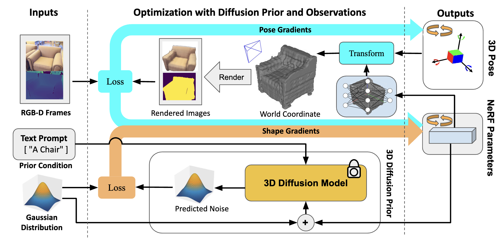
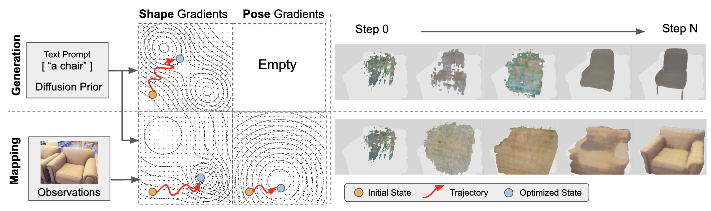

# GOM: General Object-Level Mapping

## CoRL 2024 | Spotlight 🔦
### [[ArXiv](https://arxiv.org/abs/2410.05514)] [[OpenReview](https://openreview.net/forum?id=rEteJcq61j&noteId=rEteJcq61j)] [[Poster](https://drive.google.com/file/d/1UgxT37mpAs6PgoWYJq0A1QBYnhwSnOJb/view?usp=sharing)] [[Slides](https://drive.google.com/file/d/1B9A2iu1J2ZcwMCs5HWlLgJDmyt9j1PzF/view?usp=sharing)] [[Code](https://github.com/TRAILab/GeneralObjectMapping)]

This is the official implementation of our work presented at CoRL 2024, titled "[Toward General Object-level Mapping from Sparse Views with 3D Diffusion Priors](https://openreview.net/forum?id=rEteJcq61j&noteId=rEteJcq61j)."

## Framework

We propose an object-level mapping framework that fuses both multi-view observations and a pre-trained diffusion shape prior model. It generalizes to multicategories objects, and multiple multi-modalities observations without the need of fine-tuning.




### Optimization with Gradients from 3D Diffusion Model

The gradient fields from two sources, a diffusion prior originally for Generation, and multi-view non-linear observation constraints, are effectively fused into a shape and pose optimization formulation for Mapping.



# Install

## Hardware Requirements

**Our methods do not require training or fine-tuning any neural networks**, thus demanding relatively small GPU memory. 

Our code runs on an Ubuntu system with an Nvidia GPU and CUDA support. A single GPU with at least 10GB of memory is enough. We have tested the implementation on the following GPUs: 1080 Ti, V100, and A100.

## Dependencies

Create a conda environment:

```
conda create -n gom python==3.10
conda activate gom
```

Install Torch. Below is an example for `Torch 1.12` and `CUDA 11.3`. Please refer to [this link](https://pytorch.org/get-started/previous-versions/) for instructions based on your hardware.

```
conda install pytorch==1.12.1 torchvision==0.13.1 torchaudio==0.12.1 cudatoolkit=11.3 -c pytorch
```

Clone the repository:
```
git clone git@github.com:TRAILab/GeneralObjectMapping.git
```


Install the remaining Python packages. (Note: Install `pytorch3d` only for CO3D.) 

```
pip install -r requirements.txt
``` 


## Install the Generative Prior Model

We use [Shap-E](https://github.com/openai/shap-e) as the pre-trained multi-category shape prior model. For convenience, we have included a Shap-E repository in `./src/shap-e`, which contains utility code to assist with our project. Please ensure that you use it in accordance with Shap-E's copyrights.


Install `shap_e` in your conda environment:

```
pip install src/shap-e
```

Shap-E will automatically download the pre-trained weights during its initial run.

Generate prior meshes for the categories we will use. These meshes will be utilized to initialize pose estimation with ICP to align with depth data. The categories are defined in `configs/categories.txt` and will be saved to `./shap_e_prior_meshes`.

```
python generate_prior_meshes.py
```

# Examples

We provide examples using the `CO3D` and `ScanNet` datasets.

## CO3D Datasets

The CO3D dataset includes sequences from 10 categories: Toy Truck, Bench, Donut, Broccoli, Toy Train, Apple, Teddy Bear, Hydrant, Book, and Toaster.

### Data Preparation

Download the `Single-sequence dataset subset` of the CO3D Datasets for demos by [following the instructions](https://github.com/facebookresearch/co3d?tab=readme-ov-file#single-sequence-dataset-subset):

```
git clone git@github.com:facebookresearch/co3d.git
cd co3d
python ./co3d/download_dataset.py --download_folder DOWNLOAD_FOLDER --single_sequence_subset
```

Please also install `pytorch3d` for the CO3D data loader.

```
pip install git+https://github.com/facebookresearch/pytorch3d.git@V0.7.8
```

### Demo Mapping: Optimizing Shapes and Poses

To run demos with a specific category, please specify `--dataset_category` as teddybear, donut, hydrant, broccoli, toaster, toytruck, bench, toytrain, apple, or book:

```
python test_co3d.py --config configs/GOM_CO3D.json \
  --sequence_dir data/co3d \
  --save_root ./output/co3d/ \
  --dataset_category teddybear
```

This script will estimate an initial pose using Iterative Closest Point (ICP) matching against an average shape generated from Shap-E. It will then optimize both shapes and poses using diffusion priors and differentiable rendered images from 10 views.

We provide more detailed guidance on the outputs and hyperparameters of the experiments [in a document](docs/experiment_detail.md).

## ScanNet Dataset

The ScanNet dataset contains indoor environments featuring large furniture items.

### Data Preparation

We provide a mini ScanNet set for a quick demo. [Download the ScanNet mini dataset following here](https://drive.google.com/file/d/1VI6YEyRYDe8QQEN2ERFOKlu13RylDQR9/view?usp=sharing) and unzip it to ```data/scannet_mini```. 

### Demo Mapping: Optimizing Shapes and Poses

The script will run the pose and shape estimation algorithm on a `chair` instance from 10 views.

```
python test_scannet.py --config configs/GOM_ScanNet.json \
  --sequence_dir data/scannet_mini/ \
  --save_root ./output/scannet/
```

### Process the Complete ScanNet Dataset

Please download the full ScanNet dataset, along with the Scan2CAD object annotations and ShapeNet models, from [here](https://github.com/skanti/Scan2CAD). 

Download the association file [here](https://drive.google.com/file/d/1vh_Utvgsh_PGX0nuFe3JJFwRf1Q2ztOb/view?usp=sharing), and put it under `data/scannet/data/Scan2CAD/indices_to_scannet`. It is used to extract the GT Masks provided by the ScanNet using instance ID from Scan2CAD. 

The final data structure is:

```
- data/
  - scannet/
    - data/
      - posed_images/
      - Scan2CAD/
        - indices_to_scannet/
      - scans/
      - ShapeNetCore.v2/
    - scannetv2_val.txt
- src/
```

The ScanNet dataset includes thousands of scenes and objects. We create splits for frames, instances, and scenes based on object visibility, ensuring that each split includes at least 10 frames and an observation ratio of 0.2. Run the provided script to generate the split file:


```
python src/tools/dataset_process/generate_scannet_splits.py \
  --category chair \
  --dataset_root ./data/scannet/ \
  --save_dir ./output/splits/
```

We offer a [merge tool](src/tools/dataset_process/merge_multi_category_split.py) to combine all categories into a single file. Once that's done, you can run experiments on all datasets using:

```
python test_scannet.py --config configs/GOM_ScanNet.json \
  --dataset_subset_package PATH/TO/SPLITS \
  --sequence_dir data/scannet/ \
  --save_root ./output/scannet/
```


## Additional Experiment Guidance

For more detailed information on the experiment outputs and hyperparameters, please refer to [the document](docs/experiment_detail.md).

Feel free to contact the authors or raise any issues if you have further questions.

## Reference

Please cite our paper if you use this codebase:

```
@inproceedings{liaotoward,
  title={Toward General Object-level Mapping from Sparse Views with 3D Diffusion Priors},
  author={Liao, Ziwei and Xu, Binbin and Waslander, Steven L},
  booktitle={8th Annual Conference on Robot Learning}
}
```

If you're interested in learning more, feel free to explore our previous related work on object-level mapping:

* [Uncertainty-aware 3D Object-Level Mapping with Deep Shape Priors](https://arxiv.org/pdf/2309.09118), ICRA'24
* [Multi-View 3D Object Reconstruction and Uncertainty Modelling With Neural Shape Prior](https://arxiv.org/abs/2306.11739), WACV'24
* [SO-SLAM: Semantic Object SLAM with Scale Proportional and Symmetrical Texture Constraints](https://ieeexplore.ieee.org/abstract/document/9705562), RA-L and ICRA'22.


# License

Our repository is released under the MIT License. [Shap-E](https://github.com/openai/shap-e) is also released under the MIT License. The ICP initialization code is referenced from our previous codebase, [UncertainShapePose](https://github.com/TRAILab/UncertainShapePose).

<!-- 
# Acknowledgement

We thank the authors for the codebases [UncertainShapePose](https://github.com/TRAILab/UncertainShapePose) and [Shap-E](https://github.com/openai/shap-e) for the valuable work.

 -->
